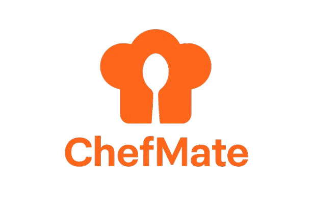

# 🍳 ChefMate - AI-Powered Recipe Discovery & Meal Planning Platform

<div align="center">



**Transform your ingredients into culinary masterpieces with AI**

[](https://reactjs.org/)
[](https://nodejs.org/)
[](https://www.mongodb.com/)
[](https://tailwindcss.com/)

[Features](#-features) • [Demo](#-demo) • [Installation](#-installation) • [Tech Stack](#-tech-stack) • [API Documentation](#-api-documentation) • [Contributing](#-contributing)

</div>

---

## 📖 Overview

**ChefMate** is a full-stack AI-powered recipe discovery and meal planning application that revolutionizes home cooking. Simply input your available ingredients, dietary preferences, and time constraints, and let our AI chef generate personalized, nutritious recipes tailored just for you. Save your favorites, plan weekly meals, and share your culinary creations with friends and family.

### 🎯 Why ChefMate?

- **Zero Food Waste**: Use what you have in your pantry
- **AI-Powered Intelligence**: Smart recipe generation using advanced language models
- **Personalized Nutrition**: Dietary preferences and health-conscious recommendations
- **Meal Planning Made Easy**: Organize your weekly meals effortlessly
- **Community Sharing**: Share recipes via WhatsApp or direct links
- **Cook Mode**: Step-by-step guided cooking with built-in timers

---

## ✨ Features

### 🤖 AI-Powered Recipe Generation
- **Smart Recipe Creator**: Generate complete recipes from your available ingredients
- **Dietary Preferences**: Support for Vegetarian, Vegan, Keto, Paleo diets
- **Time Constraints**: Filter recipes by maximum cooking time
- **Health Benefits**: AI-generated nutritional insights for each recipe
- **Fallback System**: Reliable local recipe generation when AI services are rate-limited

### 🍽️ Recipe Management
- **Save Favorites**: Store your favorite recipes to your profile
- **Recipe Discovery**: Browse thousands of recipes from TheMealDB API
- **Advanced Filtering**: Search by ingredients, cuisine, category, and region
- **Recipe Sharing**: Share recipes via WhatsApp or shareable links
- **Cook Mode**: Interactive step-by-step cooking interface with timers

### 📅 Meal Planning
- **AI Meal Planner**: Generate complete meal plans for 1-14 days
- **Calorie Tracking**: Set daily calorie targets
- **Dietary Customization**: Meal plans tailored to your diet preferences
- **Save & Organize**: Store multiple meal plans for future reference
- **Detailed Breakdown**: Breakfast, lunch, dinner, and snack suggestions

### 👤 User Experience
- **Secure Authentication**: JWT-based user authentication with bcrypt password hashing
- **User Profiles**: Personalized dashboard with saved recipes and meal plans
- **Responsive Design**: Beautiful UI that works on all devices
- **Real-time Notifications**: Toast notifications for user feedback
- **Google Analytics**: Track user engagement and app performance
- **Modern UI/UX**: Gradient designs, smooth animations, and intuitive navigation

### 🔒 Security & Performance
- **Rate Limiting**: Protect API endpoints from abuse
- **Input Validation**: Zod schema validation for all API requests
- **Error Handling**: Comprehensive error handling with user-friendly messages
- **Optimized Performance**: Fast load times and efficient data fetching
- **Environment Variables**: Secure configuration management


---

## 🚀 Installation

### Prerequisites

Before you begin, ensure you have the following installed:
- **Node.js** (v18 or higher) - [Download](https://nodejs.org/)
- **MongoDB** (Local instance or MongoDB Atlas) - [Setup Guide](https://www.mongodb.com/docs/manual/installation/)
- **OpenRouter API Key** - [Get API Key](https://openrouter.ai/)

### 1. Clone the Repository

```bash
git clone https://github.com/mayurCoder2004/chefmate.git
cd chefmate
```

### 2. Backend Setup

```bash
# Navigate to backend directory
cd backend

# Install dependencies
npm install

# Create .env file
touch .env
```

Add the following environment variables to `backend/.env`:

```env
# Server Configuration
PORT=5000

# Database
MONGO_URI=your_mongodb_connection_string

# Authentication
JWT_SECRET=your_jwt_secret_key_here

# AI Service
OPENROUTER_API_KEY=your_openrouter_api_key

# Optional: OpenRouter Configuration
OPENROUTER_MODELS=google/gemini-2.0-flash-exp:free,meta-llama/llama-3.3-70b-instruct:free,mistralai/mistral-7b-instruct:free
OPENROUTER_MAX_RETRIES=1
OPENROUTER_TIMEOUT_MS=15000
OPENROUTER_MAX_TOKENS=1200
```

**Start the backend server:**

```bash
# Development mode with auto-reload
npm run dev

# Production mode
npm start
```

The backend server will run on `http://localhost:5000`

### 3. Frontend Setup

Open a new terminal window:

```bash
# Navigate to frontend directory
cd frontend

# Install dependencies
npm install

# Create .env file
touch .env
```

Add the following to `frontend/.env`:

```env
# API Configuration
VITE_BASE_URL=http://localhost:5000

# Google Analytics (Optional)
VITE_GA_TRACKING_ID=your_google_analytics_id
```

**Start the frontend development server:**

```bash
npm run dev
```

The frontend will run on `http://localhost:5173` (or the port shown in your terminal)

### 4. Access the Application

Open your browser and navigate to:
- **Frontend**: `http://localhost:5173`
- **Backend API**: `http://localhost:5000`

---

## 🛠️ Tech Stack

### Frontend
| Technology | Purpose | Version |
|------------|---------|---------|
| **React** | UI Framework | 19.1.1 |
| **Vite** | Build Tool & Dev Server | 7.1.2 |
| **React Router DOM** | Client-side Routing | 7.8.1 |
| **Tailwind CSS** | Styling Framework | 3.4.17 |
| **Axios** | HTTP Client | 1.11.0 |
| **Lucide React** | Icon Library | 1.14.0 |
| **React Hot Toast** | Notifications | 2.6.0 |
| **React GA4** | Google Analytics | 3.0.1 |
| **clsx** | Conditional Classnames | 2.1.1 |

### Backend
| Technology | Purpose | Version |
|------------|---------|---------|
| **Node.js** | Runtime Environment | - |
| **Express** | Web Framework | 5.1.0 |
| **MongoDB** | Database | - |
| **Mongoose** | ODM | 8.17.2 |
| **JWT** | Authentication | 9.0.2 |
| **bcryptjs** | Password Hashing | 3.0.2 |
| **Zod** | Schema Validation | 4.1.0 |
| **Axios** | HTTP Client | 1.11.0 |
| **Express Rate Limit** | API Rate Limiting | 8.5.0 |
| **CORS** | Cross-Origin Resource Sharing | 2.8.5 |
| **dotenv** | Environment Variables | 17.2.1 |

### AI Integration
| Service | Purpose |
|---------|---------|
| **OpenRouter API** | Multi-model AI access (Gemini, Llama, Mistral) |
| **Google Generative AI** | AI recipe generation |
| **TheMealDB API** | Recipe database |

---

## 📁 Project Structure

```
chefmate/
├── backend/                      # Node.js Express Server
│   ├── config/
│   │   └── db.js                # MongoDB connection configuration
│   ├── controllers/
│   │   └── authController.js    # Authentication logic
│   ├── middlewares/
│   │   └── auth.js              # JWT verification middleware
│   ├── models/
│   │   ├── User.js              # User schema with recipes & meal plans
│   │   └── SharedRecipe.js      # Shared recipe schema
│   ├── routes/
│   │   ├── authRoutes.js        # Auth endpoints
│   │   ├── recipeRoutes.js      # Recipe CRUD operations
│   │   ├── mealPlanRoutes.js    # Meal planning endpoints
│   │   ├── aiRecipeRoutes.js    # AI recipe generation
│   │   └── shareRoutes.js       # Recipe sharing endpoints
│   ├── services/
│   │   └── openRouterService.js # OpenRouter AI integration
│   ├── .env                     # Environment variables
│   ├── server.js                # Main application entry point
│   └── package.json             # Backend dependencies
│
├── frontend/                     # React Application
│   ├── public/
│   │   ├── chefmate-logo.png    # App logo
│   │   └── vite.svg             # Vite logo
│   ├── src/
│   │   ├── assets/              # Images and static assets
│   │   ├── components/
│   │   │   ├── home/            # Home page components
│   │   │   ├── landing/         # Landing page components
│   │   │   ├── Footer.jsx
│   │   │   ├── Navbar.jsx
│   │   │   ├── PrivateRoute.jsx
│   │   │   ├── RecipeCard.jsx
│   │   │   ├── ScrollToTop.jsx
│   │   │   └── SidebarFilters.jsx
│   │   ├── contexts/
│   │   │   └── AuthContext.jsx  # Authentication context
│   │   ├── hooks/
│   │   │   └── useAnalytics.js  # Google Analytics hook
│   │   ├── pages/
│   │   │   ├── LandingPage.jsx  # Marketing landing page
│   │   │   ├── Login.jsx        # User login
│   │   │   ├── Signup.jsx       # User registration
│   │   │   ├── Profile.jsx      # User dashboard
│   │   │   ├── SmartRecipe.jsx  # AI recipe generator
│   │   │   ├── Recipe.jsx       # Recipe browser
│   │   │   ├── RecipePage.jsx   # Recipe details
│   │   │   ├── AiRecipePage.jsx # AI-generated recipe view
│   │   │   ├── MealPlanner.jsx  # Meal planning interface
│   │   │   ├── CookMode.jsx     # Step-by-step cooking
│   │   │   ├── SharedRecipe.jsx # Public recipe view
│   │   │   ├── More.jsx         # Additional features
│   │   │   └── ErrorPage.jsx    # 404 page
│   │   ├── services/
│   │   │   └── mealdb.js        # TheMealDB API integration
│   │   ├── analytics.js         # Google Analytics setup
│   │   ├── App.jsx              # Main app component
│   │   ├── main.jsx             # React entry point
│   │   └── index.css            # Global styles
│   ├── .env                     # Frontend environment variables
│   ├── index.html               # HTML template
│   ├── tailwind.config.js       # Tailwind configuration
│   ├── vite.config.js           # Vite configuration
│   ├── vercel.json              # Vercel deployment config
│   └── package.json             # Frontend dependencies
│
├── .gitignore                   # Git ignore rules
└── README.md                    # Project documentation
```

---

## 🔌 API Documentation

### Base URL
```
http://localhost:5000/api
```

### Authentication Endpoints

#### Register User
```http
POST /api/auth/register
Content-Type: application/json

{
  "name": "John Doe",
  "email": "john@example.com",
  "password": "securePassword123"
}

Response: 201 Created
{
  "token": "jwt_token_here",
  "user": {
    "id": "user_id",
    "name": "John Doe",
    "email": "john@example.com"
  }
}
```

#### Login User
```http
POST /api/auth/login
Content-Type: application/json

{
  "email": "john@example.com",
  "password": "securePassword123"
}

Response: 200 OK
{
  "token": "jwt_token_here",
  "user": {
    "id": "user_id",
    "name": "John Doe",
    "email": "john@example.com"
  }
}
```

### Recipe Endpoints

#### Generate Smart Recipe (AI)
```http
POST /api/smart-recipe
Content-Type: application/json

{
  "ingredients": ["tomato", "onion", "rice"],
  "prefs": {
    "diet": "veg",
    "maxTime": 30
  }
}

Response: 200 OK
{
  "modelUsed": "google/gemini-2.0-flash-exp:free",
  "title": "Tomato Rice Bowl",
  "usedIngredients": ["tomato", "onion", "rice"],
  "optionalIngredients": ["oil", "salt", "turmeric"],
  "healthBenefits": ["Rich in vitamins", "Low sodium"],
  "cookingSteps": ["Step 1...", "Step 2..."],
  "estimatedTime": 25,
  "servings": 2,
  "notes": "Delicious and healthy"
}
```

#### Save Recipe
```http
POST /api/recipes/save
Authorization: Bearer {token}
Content-Type: application/json

{
  "title": "Recipe Name",
  "usedIngredients": ["ingredient1", "ingredient2"],
  "cookingSteps": ["step1", "step2"],
  "estimatedTime": 30
}

Response: 200 OK
{
  "message": "Recipe saved successfully",
  "savedRecipes": [...]
}
```

#### Get Saved Recipes
```http
GET /api/recipes/saved
Authorization: Bearer {token}

Response: 200 OK
{
  "savedRecipes": [
    {
      "_id": "recipe_id",
      "title": "Recipe Name",
      "usedIngredients": [...],
      "cookingSteps": [...],
      "estimatedTime": 30,
      "createdAt": "2024-01-01T00:00:00.000Z"
    }
  ]
}
```

#### Remove Recipe
```http
DELETE /api/recipes/remove/:recipeId
Authorization: Bearer {token}

Response: 200 OK
{
  "message": "Recipe removed successfully",
  "savedRecipes": [...]
}
```

### Meal Plan Endpoints

#### Generate Meal Plan (AI)
```http
POST /api/meal-plan
Content-Type: application/json

{
  "days": 3,
  "diet": "veg",
  "calories": 2000
}

Response: 200 OK
{
  "mealPlan": [
    {
      "day": 1,
      "meals": [
        {
          "name": "Breakfast",
          "ingredients": ["oats", "milk", "banana"],
          "instructions": "Cook oats with milk...",
          "calories": 350
        },
        {
          "name": "Lunch",
          "ingredients": [...],
          "instructions": "...",
          "calories": 600
        },
        {
          "name": "Dinner",
          "ingredients": [...],
          "instructions": "...",
          "calories": 550
        }
      ]
    }
  ]
}
```

#### Save Meal Plan
```http
POST /api/meal-plan/save
Authorization: Bearer {token}
Content-Type: application/json

{
  "mealPlan": [...],
  "diet": "veg"
}

Response: 200 OK
{
  "message": "Meal plan saved successfully"
}
```

#### Get Saved Meal Plans
```http
GET /api/meal-plan
Authorization: Bearer {token}

Response: 200 OK
{
  "savedMealPlans": [
    {
      "plan": [...],
      "diet": "veg",
      "createdAt": "2024-01-01T00:00:00.000Z"
    }
  ]
}
```

### Share Endpoints

#### Create Shareable Recipe
```http
POST /api/share-recipe
Content-Type: application/json

{
  "title": "Recipe Name",
  "usedIngredients": [...],
  "cookingSteps": [...],
  "estimatedTime": 30
}

Response: 201 Created
{
  "shareId": "unique_share_id",
  "message": "Recipe shared successfully"
}
```

#### Get Shared Recipe
```http
GET /api/share-recipe/:shareId

Response: 200 OK
{
  "title": "Recipe Name",
  "usedIngredients": [...],
  "cookingSteps": [...],
  "estimatedTime": 30
}
```

### Rate Limiting

| Endpoint | Limit | Window |
|----------|-------|--------|
| `/api/smart-recipe` | 15 requests | 15 minutes |
| `/api/meal-plan` | 10 requests | 15 minutes |
| `/api/recipe` (AI) | 20 requests | 15 minutes |

---

## 🎨 Key Features Explained

### 1. AI Recipe Generation with Fallback System

ChefMate uses a sophisticated multi-model AI approach:

```javascript
// Primary models (in order of preference)
1. Google Gemini 2.0 Flash
2. Meta Llama 3.3 70B
3. Mistral 7B
4. Qwen3 Coder

// Fallback mechanism
- If AI service is rate-limited → Local recipe generation
- If response is invalid → Retry with next model
- If all models fail → Generate basic recipe locally
```

### 2. Smart Recipe Normalization

The backend intelligently parses AI responses:
- Handles JSON, markdown code blocks, and plain text
- Extracts structured data from various formats
- Validates required fields (title, ingredients, steps)
- Ensures consistent output format

### 3. Cook Mode Features

Interactive cooking experience:
- **Step-by-step navigation**: Previous/Next buttons
- **Progress tracking**: Visual progress bar and step indicators
- **Built-in timers**: Quick-set timers (1, 2, 5, 10, 15 minutes)
- **Ingredient reference**: Collapsible ingredient list
- **Completion celebration**: Share your finished dish

### 4. Recipe Sharing System

Two sharing methods:
1. **WhatsApp Direct**: Opens WhatsApp with pre-filled message
2. **Universal Share**: Uses Web Share API or clipboard fallback

Shared recipes are:
- Stored in MongoDB with unique IDs
- Accessible without authentication
- Beautifully formatted for public viewing
- Include call-to-action for new users

---

## 🔐 Environment Variables

### Backend (.env)

| Variable | Description | Required | Default |
|----------|-------------|----------|---------|
| `PORT` | Server port | No | 5000 |
| `MONGO_URI` | MongoDB connection string | Yes | - |
| `JWT_SECRET` | JWT signing secret | Yes | - |
| `OPENROUTER_API_KEY` | OpenRouter API key | Yes | - |
| `OPENROUTER_MODELS` | Comma-separated model list | No | See config |
| `OPENROUTER_MAX_RETRIES` | Max retries per model | No | 1 |
| `OPENROUTER_TIMEOUT_MS` | Request timeout | No | 15000 |
| `OPENROUTER_MAX_TOKENS` | Max output tokens | No | 1200 |

### Frontend (.env)

| Variable | Description | Required | Default |
|----------|-------------|----------|---------|
| `VITE_BASE_URL` | Backend API URL | Yes | - |
| `VITE_GA_TRACKING_ID` | Google Analytics ID | No | - |

---

## 🚢 Deployment

### Backend Deployment (Railway/Render/Heroku)

1. **Prepare for deployment:**
```bash
cd backend
npm install
```

2. **Set environment variables** on your hosting platform

3. **Deploy:**
```bash
git push heroku main
# or use platform-specific deployment
```

### Frontend Deployment (Vercel/Netlify)

1. **Build the frontend:**
```bash
cd frontend
npm run build
```

2. **Deploy to Vercel:**
```bash
npm install -g vercel
vercel --prod
```

3. **Configure environment variables** in Vercel dashboard

### MongoDB Atlas Setup

1. Create account at [MongoDB Atlas](https://www.mongodb.com/cloud/atlas)
2. Create a new cluster
3. Add database user
4. Whitelist IP addresses (0.0.0.0/0 for development)
5. Get connection string and add to `MONGO_URI`

---

## 🧪 Testing

### Run Backend Tests
```bash
cd backend
npm test
```

### Run Frontend Tests
```bash
cd frontend
npm test
```

### Manual Testing Checklist

- [ ] User registration and login
- [ ] AI recipe generation with various ingredients
- [ ] Recipe saving and removal
- [ ] Meal plan generation
- [ ] Recipe sharing (WhatsApp and direct link)
- [ ] Cook mode navigation and timers
- [ ] Recipe browsing and filtering
- [ ] Responsive design on mobile/tablet/desktop

---

## 🤝 Contributing

We welcome contributions! Here's how you can help:

### 1. Fork the Repository

```bash
git clone https://github.com/your-username/chefmate.git
cd chefmate
```

### 2. Create a Feature Branch

```bash
git checkout -b feature/amazing-feature
```

### 3. Make Your Changes

- Follow the existing code style
- Add comments for complex logic
- Update documentation if needed

### 4. Commit Your Changes

```bash
git add .
git commit -m "Add amazing feature"
```

### 5. Push and Create Pull Request

```bash
git push origin feature/amazing-feature
```

Then open a Pull Request on GitHub.

### Code Style Guidelines

- **Frontend**: Use functional components with hooks
- **Backend**: Use async/await for asynchronous operations
- **Naming**: Use camelCase for variables, PascalCase for components
- **Comments**: Add JSDoc comments for functions
- **Formatting**: Use Prettier/ESLint configurations

---

## 🐛 Known Issues & Roadmap

### Known Issues
- [ ] Rate limiting may affect AI generation during peak usage
- [ ] Some TheMealDB recipes may have incomplete data
- [ ] Mobile keyboard may overlap input fields on some devices

### Roadmap
- [ ] **v2.0**: User recipe ratings and reviews
- [ ] **v2.1**: Social features (follow users, recipe feeds)
- [ ] **v2.2**: Grocery list generation from meal plans
- [ ] **v2.3**: Nutritional information calculator
- [ ] **v2.4**: Recipe video tutorials
- [ ] **v2.5**: Multi-language support
- [ ] **v3.0**: Mobile app (React Native)

---

## 📄 License

This project is licensed under the **ISC License**.

---

## 👨‍💻 Author

**Mayur Coder**
- GitHub: [@mayurCoder2004](https://github.com/mayurCoder2004)

---

## 🙏 Acknowledgments

- **OpenRouter** - Multi-model AI API access
- **TheMealDB** - Recipe database API
- **Google Fonts** - Syne and DM Sans fonts
- **Lucide Icons** - Beautiful icon library
- **Tailwind CSS** - Utility-first CSS framework
- **React Community** - Amazing ecosystem and support

---

## 📞 Support

If you encounter any issues or have questions:

1. **Check the documentation** above
2. **Search existing issues** on GitHub
3. **Create a new issue** with detailed information
4. **Contact**: Open an issue on GitHub

---

## ⭐ Show Your Support

If you find ChefMate helpful, please consider:
- ⭐ Starring the repository
- 🍴 Forking the project
- 📢 Sharing with friends and colleagues
- 🐛 Reporting bugs
- 💡 Suggesting new features

---

<div align="center">

**Made with ❤️ and 🍳 by Mayur**

[⬆ Back to Top](#-chefmate---ai-powered-recipe-discovery--meal-planning-platform)

</div>
